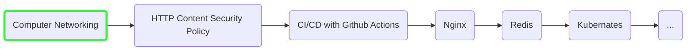
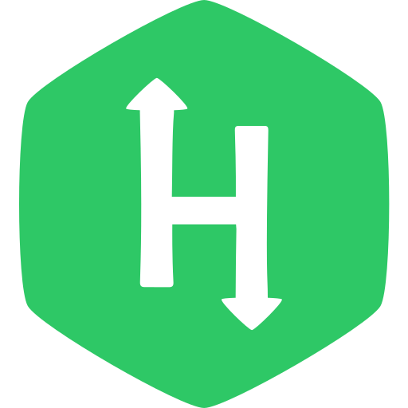

## Hi there, I'm Sifat

#### I am

- a full-stack (backend-heavy) JavaScript/Typescript developer currently working
  on the MERN stack.
- a hardcore GNU/Linux user and I literally live in the terminal emulator.
- a supporter of open-source and privacy-respecting software.
- passionate about low-level stuff and knowing how things work under the hood.
- a quick lerner and always striving to become a better programmer.

#### My favorite

- Shell: ZSH
- Code editor: NeoVim
- Operating System: PopOS
- Programming language: TypeScript
- Authors: Robert C. Martin, Kyle Simpson (YDKJS) ...
- Tutors: [Mosh Hamedani](https://codewithmosh.com), [Samer Buna](https://samer.dev/), [Hussein Nasser](https://www.youtube.com/c/HusseinNasser-software-engineering/videos) ...
- Tech personalities: Richard Stallman, Linus Torvalds, [Denis Pushkarev (the author of core.js)](https://github.com/zloirock) ...
- YouTube channels: Ben Eater, 3Blue1Brown, Hussein Nasser, suckerpinch, MIT OpenCourseWare, Veritasium ...

## Skills

#### Programming Languages

| **Good at**                                                    | **Familiar with**                                                 |
| -------------------------------------------------------------- | ----------------------------------------------------------------- |
|  |  |

#### Frontend

| **Good at**                                                       | **Familiar with**                                                              |
| ----------------------------------------------------------------- | ------------------------------------------------------------------------------ |
|  |  |

#### Backend

#### Databases

#### Other

#### Learning

I'm currently learning **Distributed systems with Node.js.**

**Current Learning Path:**

## Projects

#### Web apps

| Name                                                                                                          | Description                                                                                                                                 |
| ------------------------------------------------------------------------------------------------------------- | ------------------------------------------------------------------------------------------------------------------------------------------- |
| Techland  | An e-commerce application. [Backend](https://github.com/h-sifat/techland-backend), [Frontend](https://github.com/h-sifat/techland-frontend) |
| [word-unscrambler-visualizer](https://github.com/h-sifat/word-unscrambler-visualizer)                         | Word unscrambling algorithm visualizer.                                                                                                     |

#### Library / Frameworks

| Name                                                                      | Description                                                      |
| ------------------------------------------------------------------------- | ---------------------------------------------------------------- |
| [express-ipc](https://github.com/h-sifat/express-ipc)                     | Express like server and Axios like client for IPC communication. |
| [flexible-tree-printer](https://github.com/h-sifat/flexible-tree-printer) | A library to print tree in the console.                          |
| [handy-types](https://github.com/h-sifat/handy-types)                     | A cool little validation/assertion library.                      |
| [char-series](https://github.com/h-sifat/char-series)                     | A CLI/Library to generate character series.                      |
| [permcon](https://github.com/h-sifat/permcon)                             | A CLI/library to convert and analyze Unix file permission.       |

#### CLI/TUI

| Name                                                                | Description               |
| ------------------------------------------------------------------- | ------------------------- |
| [productivity-timer](https://github.com/h-sifat/productivity-timer) | A CLI/TUI Pomodoro timer. |

## Stats

  

  

  

## Certificates and Proof of Completions

####  From Hackerrank

- [CSS](https://www.hackerrank.com/certificates/5d01560a9bc9)
- [Java (Basic)](https://www.hackerrank.com/certificates/ccaf966b531e)
- [SQL (Basic)](https://www.hackerrank.com/certificates/44c726764424)
- [SQL (Intermediate)](https://www.hackerrank.com/certificates/827fc4125e99)
- [JavaScript (Basic)](https://www.hackerrank.com/certificates/843abaabbb1a)
- [JavaScript (Intermediate)](https://www.hackerrank.com/certificates/269d60e8ef07)

####  From MongoDB University

- [M001: MongoDB Basics](https://ti-user-certificates.s3.amazonaws.com/ae62dcd7-abdc-4e90-a570-83eccba49043/ce591601-0dd0-5548-b66b-9e900465c37e-sifat-hossain-67fdfc32-e94e-5c93-9e34-8d931aec9075-certificate.pdf)
- [M103: Basic Cluster Administration](https://ti-user-certificates.s3.amazonaws.com/ae62dcd7-abdc-4e90-a570-83eccba49043/ce591601-0dd0-5548-b66b-9e900465c37e-sifat-hossain-ebe6164d-7d9f-5d7e-a3fc-f1a8abc05d3d-certificate.pdf)
- [M220JS: MongoDB for JavaScript Developers](https://ti-user-certificates.s3.amazonaws.com/ae62dcd7-abdc-4e90-a570-83eccba49043/ce591601-0dd0-5548-b66b-9e900465c37e-sifat-hossain-65429619-20a3-5352-9128-944c94b1e0b5-certificate.pdf)
- [M121: The MongoDB Aggregation Framework](https://ti-user-certificates.s3.amazonaws.com/ae62dcd7-abdc-4e90-a570-83eccba49043/ce591601-0dd0-5548-b66b-9e900465c37e-sifat-hossain-3e86a87e-edf1-5431-aa9e-e6785dda2c0a-certificate.pdf)

## Links

**Email:** reach@sifat.cc
